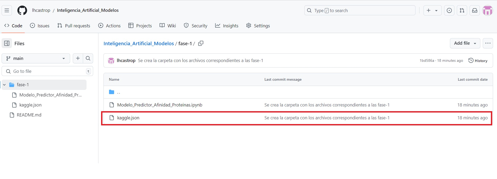
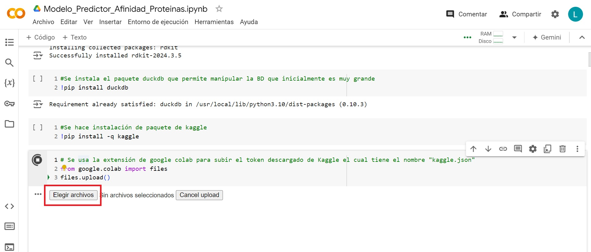
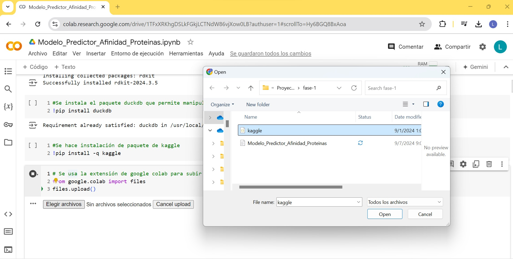
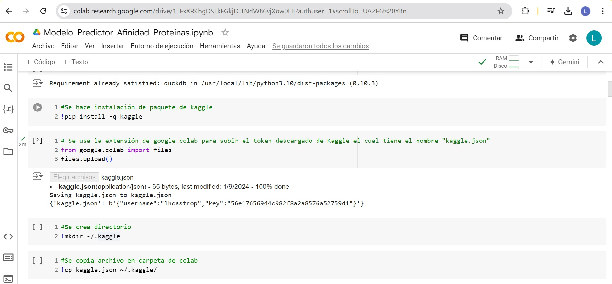

<h1 align="center"> Proyecto_Sustituto_Inteligencia_Artificial </h1>

## Contexto

En el siguiente proyecto se utilizó una solución disponible para la Competición de Kaggle llamada "NeurIPS 2024 - Predict New Medicines with BELKA". La competición buscaba el uso de Modelos de Machine Learning para predecir la afinidad entre moleculas pequeñas y determinadas proteinas objetivo usando la Gran Biblioteca Codificada para la Evaluación Quimica (BELKA).

La predicción de afinidad de las moleculas pequeñas a ciertas proteínas es fundamental para el desarrollo de medicina en la industria farmaceutica. Para el caso de la competición se usará una parte de los datos obtenidos experimentalmente en pruebas realizadas por Leash Bioscience, los cuales se encuentran en la BELKA.

BELKA es una Gran Biblioteca Codificada para la Evaluación Química que contiene aproximadamente 3.6 mil millones de mediciones de unión física entre 3.6 mil millones de moléculas pequeñas y 3 proteinas objetivo utilizando la tecnologia de biblioteca química codificada por ADN. 

El desarrollo de un modelo de Machine Learning adecuado sería util para el descubrimiento de nuevos fármacos ya que permite realizar una preselección de medicamentos candidatos con determinadas proteinas objetivo, disminuyendo de manera drastica la cantidad de pruebas de laboratorio que se deben realizar, optimizando tiempo y reduciendo costos en experimentación.

Para la competición en específico se modelará la afinidad de diferentes moléculas en 3 proteínas: EPHX2 (sEH), BRD4 y ALB (HSA). Estas proteínas estan relacionadas con presión arterial alta, progresión de diabetes y cancer. La base de datos suministrada se encuentra en un archivo .paquet, y contiene la información de las moleculas en notación SMILES (Simplified Molecular Input Line Entry System), la cual es usada para uso computacional. La base de datos tiene como salida 0 o 1, indicando si hay afinidad o no por parte de las moleculas a las 3 proteínas.

## Codigo

De las soluciones encontradas para el desafio se escogió la mejor calificada. Dicha solución tal como se ve en la siguiente imagen se puede consultar en el siguiente enlace https://www.kaggle.com/code/andrewdblevins/leash-tutorial-ecfps-and-random-forest: 

En resumen, La solución encontrada consiste en tomar la información de las moléculas codificadas en SMILES, la transforma en ECFPs (Extended-connectivity fingerprints), y posteriormente en vectores que son usados para entrenar el modelo usando el clasificador de random Forest. 

El codigo disponible se ejecutó en la herramienta Google Colab, y se puede acceder a través del siguiente enlace: https://colab.research.google.com/drive/1TFxXRKhgDSLkFGkjLCTNdW86vjXow0LB?usp=sharing

Para la manipulación de la base de datos se usa la librería duckdb, y para manipular la información de moléculas suministrada en la base de datos se usa rdkit, que es una librería open-source con quimioinformación.

Para una correcta ejecución es necesario importar la base de datos desde Kaggle por lo que debe descargarse el archivo que llamado "kaggle.json" que se encuentra dentro de la carpeta fase-1. Tal como se puede ver en la siguiente imagen: 

Una vez se descarga el archivo se procede a la ejecución en Kaggle y este se carga posterior a la ejecución de la linea de comando files.upload() tal como se puede ver en las imagenes:

Posterior a la carga y lectura del archivo se puede acceder a la base de datos para su utilización en el proyecto.

