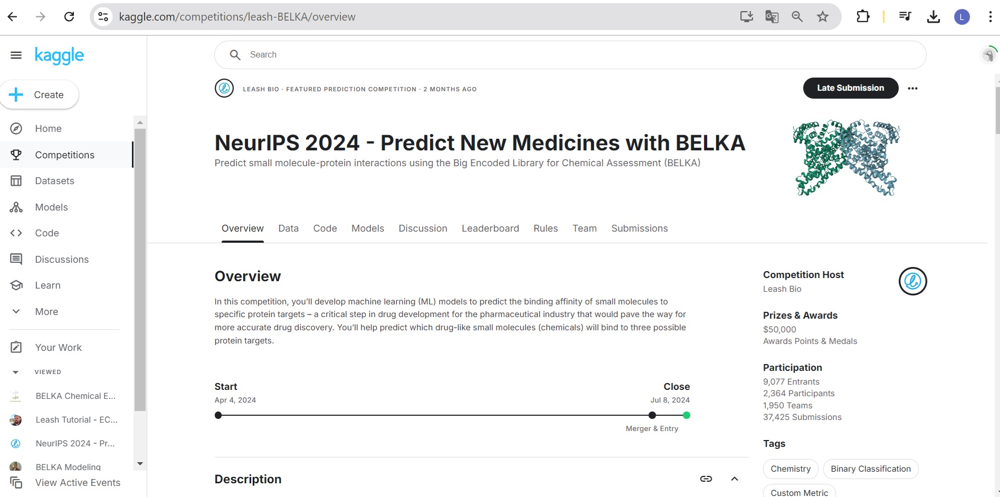
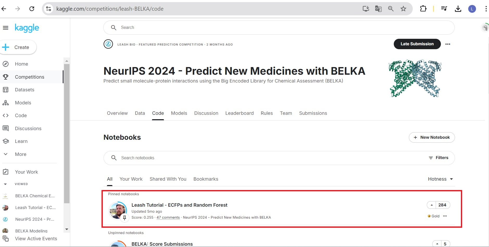

<h1 align="center"> Proyecto_Sustituto_Inteligencia_Artificial </h1>

## Contexto

En el siguiente proyecto se utilizó una solución disponible para la Competición de Kaggle llamada "NeurIPS 2024 - Predict New Medicines with BELKA". La competición buscaba el uso de Modelos de Machine Learning para predecir la afinidad entre moleculas pequeñas y determinadas proteinas objetivo usando la Gran Biblioteca Codificada para la Evaluación Quimica (BELKA).

BELKA es una Gran Biblioteca Codificada para la Evaluación Química que contiene aproximadamente 3.6 mil millones de mediciones de unión física entre 3.6 mil millones de moléculas pequeñas y 3 proteinas objetivo utilizando la tecnologia de biblioteca química codificada por ADN. Esta herramienta es util para el descubrimiento de nuevos farmacos ya que permite realizar una preselección de medicamentos candidatos con determinadas proteinas objetivo, disminuyendo de manera drastica la cantidad de pruebas de laboratorio que se deben realizar.

## Codigo

De las soluciones encontradas para el desafio se escogió la mejor calificada. Dicha solución tal como se ve en la siguiente imagen se puede consultar en el siguiente enlace https://www.kaggle.com/code/andrewdblevins/leash-tutorial-ecfps-and-random-forest: 

El codigo disponible se ejecutó en la herramienta Google Colab, para una correcta ejecución es necesario importar la base de datos desde Kaggle por lo que debe descargarse el archivo que llamado "kaggle.json" que se encuentra dentro de la carpeta fase-1. Tal como se puede ver en la siguiente imagen: 

